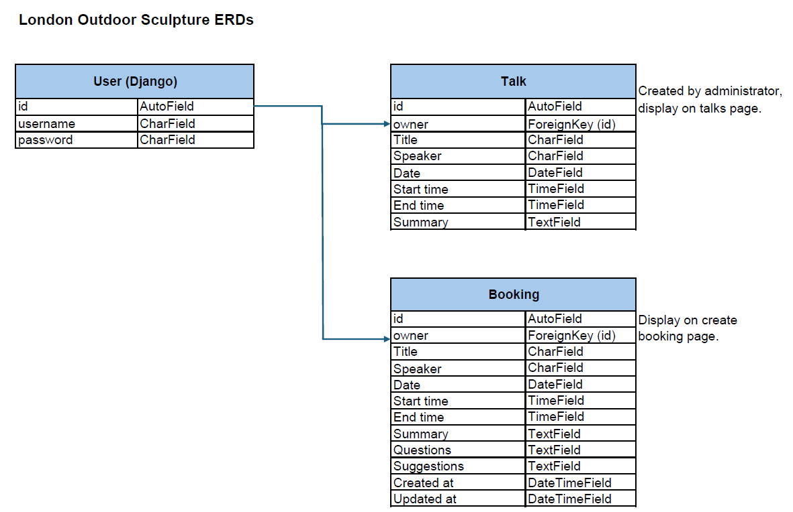

# [London Outdoor Sculpture](https://herokuapp. com)

## Project Purpose

The purpose of this project is to create a photo-sharing website for images of outdoor sculpture across the Greater London area.

Once registered, users will be able to post images, like and comment upon posts, follow other users and sign-up for online events.

The site administrator will be able to monitor and modify all aspects of the site including the deletion of posts, comments and users if necessary.

## API Database

This section of the project is the backend API database, built to support the React frontend, and is powered by the Django Rest Framework.


## XXX

## User Stories

A complete list of user stories can be found here: 


## Tools & Technologies Used

- [Markdown Builder](https://tim.2bn.dev/markdown-builder) to generate README and TESTING templates.
- [Git](https://git-scm.com) for version control. (`git add`, `git commit`, `git push`)
- [GitHub](https://github.com) for secure online code storage.
- [Gitpod](https://gitpod.io) as a cloud-based IDE for development.
- [HTML](https://en.wikipedia.org/wiki/HTML) for the main site content.
- [CSS](https://en.wikipedia.org/wiki/CSS) for the main site design and layout.
- [JavaScript](https://www.javascript.com) for user interaction on the site.
- [Python](https://www.python.org) for back-end programming.
- [Heroku](https://www.heroku.com) for hosting the deployed back-end site.
- [Bootstrap](https://img.shields.io/badge/Bootstrap-grey?logo=bootstrap&logoColor=7952B3) for the front-end CSS framework with modern responsiveness and pre-built components.
- [Django](https://www.djangoproject.com) as the Python framework for the site.
- [PostgreSQL](https://www.postgresql.org) for relational database management.
- [Neon](https://neon.tech/) to host the PostgreSQL database.
- [Cloudinary](https://cloudinary.com) for online static file storage.
- [WhiteNoise](https://whitenoise.readthedocs.io) for serving static files with Heroku.
- [Font Awesome](https://fontawesome.com) for icons.
- [Mermaid](https://mermaid.js.org/syntax/entityRelationshipDiagram.html) to generate ERDs for the completed project.

## Database Design

### Models
In designing the database I developed four models, in addition to Django's User model:
- User (Django)
- Booking
- GalleryImage
- Faqs
- Network

### Entity Relationship Diagrams (ERDs)
I then constructed an ERD in Excel for each model:



At project completion I used [Mermaid](https://mermaid.js.org/syntax/entityRelationshipDiagram.html) to auto-generate ERDs for the final project:


## Agile Project Management

See: 


### MoSCoW Prioritisation

I also used the MoSCow prioritisation model to add labels to my user stories within the issues tab:

- **Must Have**: guaranteed to be delivered.
- **Should Have**: adds significant value, but not vital.
- **Could Have**: has small impact if left out.
- **Won't Have**: not a priority for this iteration.

## Testing

For all testing, please refer to the [TESTING.md](TESTING.md) file.

## Deployment

**IMPORTANT:**

The live application is deployed on Heroku at: [Heroku](https://camden-curling-club-286959c89917.herokuapp.com).

### PostgreSQL Database

This project uses a PostgreSQL database at [Neon](https://neon.tech/).

### Cloudinary API

This project uses the [Cloudinary API](https://cloudinary.com) to store media assets online since Heroku doesn't persist this type of data.

### Heroku Deployment

This project uses [Heroku](https://www.heroku.com), a platform as a service (PaaS) that enables developers to build, run, and operate applications entirely in the cloud.

Deployment steps are as follows, after account setup:

- Select **New** in the top-right corner of your Heroku Dashboard, and select **Create new app** from the dropdown menu.
- Your app name must be unique, and then choose a region closest to you (EU or USA), and finally, select **Create App**.
- From the new app **Settings**, click **Reveal Config Vars**, and set your environment variables.

**IMPORTANT:**

This is a sample only - please replace the values with your own if cloning/forking this repository.

| Key | Value |
| --- | --- |
| `CLOUDINARY_URL` | user's own value |
| `DATABASE_URL` | user's own value |
| `DISABLE_COLLECTSTATIC` | 1 (*this is temporary, and can be removed for the final deployment*) |
| `SECRET_KEY` | user's own value |

Heroku needs three additional files in order to deploy properly.

- requirements.txt
- Procfile
- runtime.txt

You can install this project's **requirements** (where applicable) using:

- `pip3 install -r requirements.txt`

If you have your own packages that have been installed, then the requirements file needs updated using:

- `pip3 freeze --local > requirements.txt`

The **Procfile** can be created with the following command:

- `echo web: gunicorn app_name.wsgi > Procfile`
- *replace **app_name** with the name of your primary Django app name; the folder where settings.py is located*

The **runtime.txt** file needs to know which Python version you're using:
1. type: `python3 --version` in the terminal.
2. in the **runtime.txt** file, add your Python version:
    - `python-3.9.18`

For Heroku deployment, follow these steps to connect your own GitHub repository to the newly created app:

Either:

- Select **Automatic Deployment** from the Heroku app.

Or:

- In the Terminal/CLI, connect to Heroku using this command: `heroku login -i`
- Set the remote for Heroku: `heroku git:remote -a app_name` (replace *app_name* with your app name)
- After performing the standard Git `add`, `commit`, and `push` to GitHub, you can now type:
    - `git push heroku main`

The project should now be connected and deployed to Heroku!

### Local Deployment

This project can be cloned or forked in order to make a local copy on your own system.

For either method, you will need to install any applicable packages found within the *requirements.txt* file.

- `pip3 install -r requirements.txt`.

You will need to create a new file called `env.py` at the root-level,
and include the same environment variables listed above from the Heroku deployment steps.

**IMPORTANT:**

This is a sample only - please replace the values with your own if cloning/forking this repository.

Sample `env.py` file:

```python
import os

os.environ.setdefault("CLOUDINARY_URL", "user's own value")
os.environ.setdefault("DATABASE_URL", "user's own value")
os.environ.setdefault("SECRET_KEY", "user's own value")

# local environment only (do not include these in production/deployment!)
os.environ.setdefault("DEBUG", "True")
```

Once the project is cloned or forked, follow these steps run it locally:

- Start the Django app: `python3 manage.py runserver`
- Stop the app once it's loaded: `CTRL+C` or `⌘+C` (Mac)
- Make any necessary migrations: `python3 manage.py makemigrations`
- Migrate the data to the database: `python3 manage.py migrate`
- Create a superuser: `python3 manage.py createsuperuser`
- Load fixtures (if applicable): `python3 manage.py loaddata file-name.json` (repeat for each file)
- Everything should be ready now, so run the Django app again: `python3 manage.py runserver`

#### Cloning

To clone this repository, follow these steps:

1. Go to the [GitHub repository](https://github.com/Adam-Alive/camden-curling-club).
2. Locate the Code button above the list of files and click.
3. Select if you prefer to clone using HTTPS, SSH, or GitHub CLI and click the copy button to copy the URL to your clipboard.
4. Open Git Bash or Terminal.
5. Change the current working directory to the one where you want the cloned directory.
6. In your IDE Terminal, type the following command to clone my repository:
    - `git clone https://github.com/Adam-Alive/camden-curling-club.git`
7. Press Enter to create your local clone.

Alternatively, if using Gitpod, you can click below to create your own workspace using this repository:

[Open in Gitpod](https://gitpod.io/#https://github.com/Adam-Alive/camden-curling-club)

Please note that in order to directly open the project in Gitpod, you need to have the browser extension installed.
A tutorial on this can be found [here](https://www.gitpod.io/docs/configure/user-settings/browser-extension).

#### Forking

By forking the GitHub Repository, we make a copy of the original repository on our GitHub account to view and/or make changes without affecting the original owner's repository.
To fork this repository, follow these steps:

1. Log in to GitHub and locate the [GitHub Repository](https://github.com/Adam-Alive/camden-curling-club)
2. At the top of the Repository (not top of page) just above the "Settings" Button on the menu, locate the "Fork" Button.
3. Once clicked, you should now have a copy of the original repository in your own GitHub account!

## Credits

### Content

| Source | Location | Notes |
| --- | --- | --- |
| [Markdown Builder](https://tim.2bn.dev/markdown-builder) | README and TESTING | An excellent tool to help generate the Markdown files |
| [John Abdsho](https://www.youtube.com/watch?v=s5xbtuo9pR0) | bookings | Initial ideas on how to create a booking system with Django|
| [W3Schools](https://www.w3schools.com/bootstrap5/) | gallery and bookings | Additional support with Bootstrap grids and modals|
| [Stack Overflow](https://stackoverflow.com/questions/21938028/how-to-get-a-favicon-to-show-up-in-my-django-app) | favicon | How to get favicon to show in Django app |
| [Scottish Curling](https://www.scottishcurling.org/) |  home and faqs  | Reference  |
| [British Curling](https://www.britishcurling.org.uk/) |  home and faqs  | Reference  |

### Media

| Source | Location | Type | Notes |
| --- | --- | --- | --- |
| [Free Images](https://www.freeimages.com/) | home and gallery | images | Various images of curling |
| [Pexels](https://www.pexels.com/) | home and gallery  | images | Various images of curling  |
| [Pixelied](https://pixelied.com/convert/jpg-converter/jpg-to-webp) | home and gallery  | images | Convert png to webp |

### Acknowledgements

- I would like to thank my Code Institute mentor, [Martina Terlevic ](https://github.com/SephTheOverwitch), for her guidance and support throughout the development of this project.


