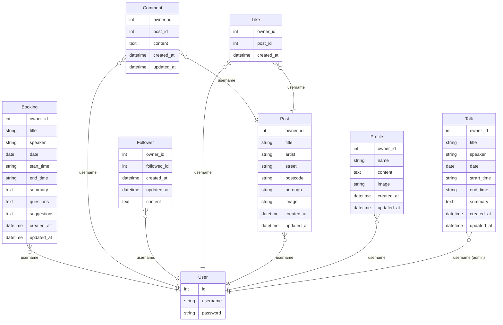

# [London Outdoor Sculpture API](https://sculpture-drf-api-2aa8ed66624d.herokuapp.com/)

## Project Purpose

The purpose of this project is to create a photo-sharing website for images of outdoor sculpture across the Greater London area.

Once registered, users will be able to post images, like and comment upon posts, follow other users and sign-up for online talks.

The site administrator will be able to monitor and modify all aspects of the site including the deletion of posts, comments and users if necessary.

## Project Structure

The project consists of a front-end, built using React, and a back-end API database built with the Django Rest Framework.

This section covers the back-end API, while the React front-end and project overall are covered here: **[London Outdoor Sculpture README](https://github.com/Adam-Alive/london-outdoor-sculpture/blob/main/README.md)**

The back-end API is deployed here: **[sculpture-drf-api](https://sculpture-drf-api-2aa8ed66624d.herokuapp.com/)**

The front-end website is deployed here **[London Outdoor Sculpture](https://london-outdoor-sculpture-392a8873bf1b.herokuapp.com/)**
## User Stories

User stories are listed here: **[User Stories](https://github.com/Adam-Alive/london-outdoor-sculpture/blob/main/README.md#user-stories)**

## Tools & Technologies Used

- [Markdown Builder](https://tim.2bn.dev/markdown-builder) to generate README and TESTING templates.
- [GitHub](https://github.com) for secure online code storage.
- [Gitpod](https://gitpod.io) as a cloud-based IDE for development.
- [Python](https://www.python.org) for back-end programming.
- [Django](https://www.djangoproject.com) as the Python framework for the site.
- [Dango Rest Framework](https://www.django-rest-framework.org) for building the back-end API.
- [PostgreSQL](https://www.postgresql.org) for relational database management.
- [Neon](https://neon.tech/) to host the PostgreSQL database.
- [Cloudinary](https://cloudinary.com) for online static file storage.
- [Heroku](https://www.heroku.com) for hosting the deployed back-end site.
- [Mermaid](https://mermaid.js.org/syntax/entityRelationshipDiagram.html) to generate ERDs for the completed project.

## Database Design

### Models
The database is comprised of eight models, including Django's User model:
- User (Django)
- Booking
- Comment
- Follower
- Like
- Post
- Profile
- Talk

I then constructed an ERD for each model and show here the Talk and Booking models:


At project completion I used [Mermaid](https://mermaid.js.org/syntax/entityRelationshipDiagram.html) to generate ERDs for the final project:



## Agile Project Management

For overall project management see: [London Outdoor Sculpture Agile Project Management](https://github.com/Adam-Alive/london-outdoor-sculpture/blob/main/README.md#agile-project-management)

### GitHub Projects and Issues

[GitHub Projects](https://github.com/Adam-Alive/sculpture-drf-api/projects?query=is%3Aopen) served as an Agile tool for developing the back-end API where epics and user stories were planned and then tracked on the [Kanban board](https://github.com/users/Adam-Alive/projects/12).

Using GitHub's projects and issues framework I created a GitHub project within the repository, and then developed issues within each:
- [API Sculpture User Stories](https://github.com/users/Adam-Alive/projects/12/views/1)

I created a user story template to manage user stories and provide here an example of a completed issue:


### MoSCoW Prioritisation

I used the MoSCow prioritisation model to add labels to my user stories within the issues tab:

- **Must Have**: guaranteed to be delivered.
- **Should Have**: adds significant value, but not vital.
- **Could Have**: has small impact if left out (and not included for the purposes of this project).
- **Won't Have**: not a priority for this iteration (and not included for the purposes of this project).

### Summary of closed issues:

- [](https://github.com/Adam-Alive/sculpture-drf-api/issues?q=is%3Aissue+is%3Aclosed)

## Testing

For all testing, please refer to the [TESTING.md](TESTING.md) file.

## Deployment

### PostgreSQL Database

This project uses a PostgreSQL database at [Neon](https://neon.tech/).

### Cloudinary API

This project uses the [Cloudinary API](https://cloudinary.com) to store media assets online since Heroku doesn't persist this type of data.

### Preparing for Deployment

### JWT tokens
The first step of deployment is setting up the JWT tokens:

First install the package in the terminal window, using the command:

`pip install dj-rest-auth==2.1.9`

In the settings.py file add the following to the "Installed Apps" section.

`'rest_framework.authtoken',`

`'dj_rest_auth',

Next, add the following URLs to the urlpatterns list:

`path('dj-rest-auth/', include('dj_rest_auth.urls')),`

In the command terminal, migrate the database just added by typing:

`python manage.py migrate`

Next we want to add the feature to enable the registration of users. Type the following into the terminal:

`pip install 'dj-rest-auth[with_social]'`

Add the following to the "Installed Apps" section in the settings.py file:

`'django.contrib.sites',
'allauth',
'allauth.account',
'allauth.socialaccount',
'dj_rest_auth.registration',`

Add SITE_ID value, which is placed under INSTALLED APPS List:

`SITE_ID = 1`

Next add the registration URLs to the urlpatterns list, as follows:

`path('dj-rest-auth/registration/', include('dj_rest_auth.registration.urls')),`

Finally, add JWT tokens functionality:

Install the djangorestframework-simplejwt package by typing the following into the terminal command window:

`pip install djangorestframework-simplejwt==5.3.1`

In the env.py file, create a session authentication value (differentiates between Dev and Prod mode):

`os.environ['DEV'] = '1'`

In the settings.py file, use the Dev value above to differentiate between Dev and Prod Modes & add pagination which is placed under SITE_ID:

`'DEFAULT_AUTHENTICATION_CLASSES': [( 
    'rest_framework.authentication.SessionAuthentication' 
    if 'DEV' in os.environ 
    else 'dj_rest_auth.jwt_auth.JWTCookieAuthentication'
)]
}`

To enable token authentication, put the following under the above step:

`REST_USE_JWT = True`

To ensure tokens are sent over HTTPS only, add the following:

`JWT_AUTH_SECURE = True`

Next, declare cookie names for the access and refresh tokens by adding:

JWT_AUTH_COOKIE = 'my-app-auth'
JWT_AUTH_REFRESH_COOKIE = 'my-refresh-token'
Now we need to add the profile_id and profile_image to fields returned when requesting logged in user’s details:

Create a new serializers.py file in the api folder. Then import the following files at the top of the new serializers file and create the profile_id and profile_image fields:

from dj_rest_auth.serializers import UserDetailsSerializer
from rest_framework import serializers

class CurrentUserSerializer(UserDetailsSerializer):
    profile_id = serializers.ReadOnlyField(source='profile.id')
    profile_image = serializers.ReadOnlyField(source='profile.image.url')

    class Meta(UserDetailsSerializer.Meta):
        fields = UserDetailsSerializer.Meta.fields + (
            'profile_id', 'profile_image'
        )
In settings.py, overwrite the default USER_DETAILS_SERIALIZER, below the JWT_AUTH_REFRESH_COOKIE = 'my-refresh-token' :

REST_AUTH_SERIALIZERS = {'USER_DETAILS_SERIALIZER': 'drf_api.serializers.CurrentUserSerializer'}
Next, in the terminal command window:

1: Run migrations

  python manage.py migrate
2: Update the requirements text file:

  pip freeze > requirements.txt
3: git add, commit and push.

Bug Fix - dj-rest-auth doesn’t allow users to log out:

In drf_api/views.py, import JWT_AUTH settings from settings.py

from .settings import (
JWT_AUTH_COOKIE, JWT_AUTH_REFRESH_COOKIE, JWT_AUTH_SAMESITE,
JWT_AUTH_SECURE,
)
Write a logout view. It can be found here

Import the logout view in drf_api/urls.py

from .views import root_route, logout_route

Include it in the urlpatterns list, above the default dj-rest-auth urls, so that it is matched first.

urlpatterns = [
    path('', root_route),
    path('admin/', admin.site.urls),
    path('api-auth/', include('rest_framework.urls')),
    path('dj-rest-auth/logout/', logout_route),
    path('dj-rest-auth/', include('dj_rest_auth.urls')),
    ...
]
Push your code to GitHub.

### Heroku Deployment

This project uses [Heroku](https://www.heroku.com), a platform as a service (PaaS) that enables developers to build, run, and operate applications entirely in the cloud.

Deployment steps are as follows, after account setup:

- Select **New** in the top-right corner of your Heroku Dashboard, and select **Create new app** from the dropdown menu.
- Your app name must be unique, and then choose a region closest to you (EU or USA), and finally, select **Create App**.
- From the new app **Settings**, click **Reveal Config Vars**, and set your environment variables.

**IMPORTANT:**

This is a sample only - please replace the values with your own if cloning/forking this repository.

| Key | Value |
| --- | --- |
| `CLOUDINARY_URL` | user's own value |
| `DATABASE_URL` | user's own value |
| `DISABLE_COLLECTSTATIC` | 1 (*this is temporary, and can be removed for the final deployment*) |
| `SECRET_KEY` | user's own value |

Heroku needs three additional files in order to deploy properly.

- requirements.txt
- Procfile
- runtime.txt

You can install this project's **requirements** (where applicable) using:

- `pip3 install -r requirements.txt`

If you have your own packages that have been installed, then the requirements file needs updated using:

- `pip3 freeze --local > requirements.txt`

The **Procfile** can be created with the following command:

- `echo web: gunicorn app_name.wsgi > Procfile`
- *replace **app_name** with the name of your primary Django app name; the folder where settings.py is located*

The **runtime.txt** file needs to know which Python version you're using:
1. type: `python3 --version` in the terminal.
2. in the **runtime.txt** file, add your Python version:
    - `python-3.9.18`

For Heroku deployment, follow these steps to connect your own GitHub repository to the newly created app:

Either:

- Select **Automatic Deployment** from the Heroku app.

Or:

- In the Terminal/CLI, connect to Heroku using this command: `heroku login -i`
- Set the remote for Heroku: `heroku git:remote -a app_name` (replace *app_name* with your app name)
- After performing the standard Git `add`, `commit`, and `push` to GitHub, you can now type:
    - `git push heroku main`

The project should now be connected and deployed to Heroku!

### Local Deployment

This project can be cloned or forked in order to make a local copy on your own system.

For either method, you will need to install any applicable packages found within the *requirements.txt* file.

- `pip3 install -r requirements.txt`.

You will need to create a new file called `env.py` at the root-level,
and include the same environment variables listed above from the Heroku deployment steps.

**IMPORTANT:**

This is a sample only - please replace the values with your own if cloning/forking this repository.

Sample `env.py` file:

```python
import os

os.environ.setdefault("CLOUDINARY_URL", "user's own value")
os.environ.setdefault("DATABASE_URL", "user's own value")
os.environ.setdefault("SECRET_KEY", "user's own value")

# local environment only (do not include these in production/deployment!)
os.environ.setdefault("DEBUG", "True")
```

Once the project is cloned or forked, follow these steps run it locally:

- Start the Django app: `python3 manage.py runserver`
- Stop the app once it's loaded: `CTRL+C` or `⌘+C` (Mac)
- Make any necessary migrations: `python3 manage.py makemigrations`
- Migrate the data to the database: `python3 manage.py migrate`
- Create a superuser: `python3 manage.py createsuperuser`
- Load fixtures (if applicable): `python3 manage.py loaddata file-name.json` (repeat for each file)
- Everything should be ready now, so run the Django app again: `python3 manage.py runserver`

#### Cloning

To clone this repository, follow these steps:

1. Go to the [GitHub repository](https://github.com/Adam-Alive/sculpture-drf-api).
2. Locate the Code button above the list of files and click.
3. Select if you prefer to clone using HTTPS, SSH, or GitHub CLI and click the copy button to copy the URL to your clipboard.
4. Open Git Bash or Terminal.
5. Change the current working directory to the one where you want the cloned directory.
6. In your IDE Terminal, type the following command to clone my repository:
    - `git clone https://github.com/Adam-Alive/sculpture-drf-api.git`
7. Press Enter to create your local clone.

#### Forking

By forking the GitHub Repository, we make a copy of the original repository on our GitHub account to view and/or make changes without affecting the original owner's repository.
To fork this repository, follow these steps:

1. Log in to GitHub and locate the [GitHub Repository](https://github.com/Adam-Alive/sculpture-drf-api)
2. At the top of the Repository (not top of page) just above the "Settings" Button on the menu, locate the "Fork" Button.
3. Once clicked, you should now have a copy of the original repository in your own GitHub account!

## Credits

### Content

| Source | Notes |
| --- | --- |
| [Code Institute](https://codeinstitute.net/) Advanced Front End Module| Django Rest Framework unit for guidance and inspiration in develping this API.|
| [Markdown Builder](https://tim.2bn.dev/markdown-builder) | An excellent tool to help generate Markdown files for the README. |
| [Stack Overflow](https://stackoverflow.com/) | For bugs and general troubleshooting. |
| [W3 Schools](https://www.w3schools.com/) | For general troubleshooting. |

### Acknowledgements

- I would like to thank my Code Institute mentor, Mitko Bachvarov, for his guidance and support throughout the development of this project.
