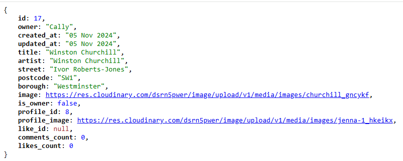
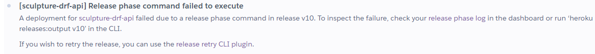
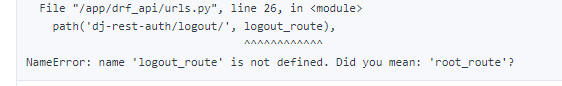
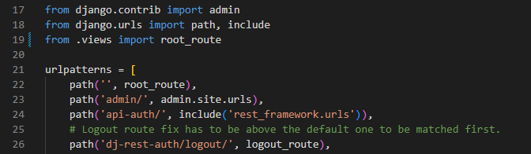
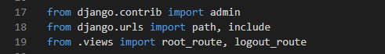
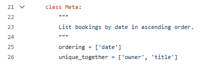

# Testing
 
> Return to the [README.md](README.md) file.
 
## Code Validation

### Python
 
I have used the [PEP8 CI Python Linter](https://pep8ci.herokuapp.com) to validate all Python files.

There were no errors, apart from minor indentation and whitespace errors, all of which have been corrected. 

A sample test is shown here:

**Test:**

**Correction:**

## Python Unit Testing

I conducted a series of automated tests on [posts/views.py](https://adamalive-sculpturedrfa-aw4zyb1un53.ws.codeinstitute-ide.net/) and acknowledge that, in a real-world scenario, an extensive set of additional tests would be required.

- Result: Pass, no errors:

## Testing URLs

By accessing the API at [sculpture-drf-api](https://sculpture-drf-api-2aa8ed66624d.herokuapp.com/) and entering the URLs in the address bar, I was able to test the integrity of each and view the relevant data elements.

For example, the root url renders the following, which passes:

Similarly, the /posts/ url renders all posts and /posts/:id/ an individual post, so both pass:

Results for all URLs are summarised below:

| URL | Result |
| --- | --- |
|root  | pass |
|/admin/  | pass  |
| /bookings/ | pass |
| /bookings/:id/ |  pass |
| /comments/ |  pass |
| /comments/:id/ | pass |
| /followers/ | pass  |
|  /followers/:id/| pass  |
| /likes/ | pass |
|  /likes/:id/| pass |
|  /posts/| pass |
| /posts/:id/ | pass |
| /profiles/ |  pass |
|  /profiles/:id/ | pass  |
| /talks/ | pass  |
| talks/:id/ | pass |

## Bugs
 
 - **Issue:** Deployment failure to Heroku.
  
 - **Fix:** Checked Heroku error log:

 

  

 Then checked `drf-api/urls.py` where I had not imported `logout_route`

 - **Before:** See line 19.

  

 - **After:** See line 19.

   

## Unfixed Bugs

 - **Duplicate bookings.**

  - When making a booking, a logged-in user is able to book a talk more than once. To resolve this, I explored the use of unique_together in the Booking model in the API, based upon the logic used to prevent duplicate likes and followers in the Like and Follower models respectively. I used the booking 'owner' and 'title' as the constraint fields:

 

 - This initially appeared to work in the development API, resulting in the expected "detail: possible duplicate" message set up in the bookings serializers:

 

- However, once passed through to the front-end, the result was that only one booking was possible for one talk ie. only one user could book a particular talk and then no other users. I spent considerable time in trying to resolve this - and tried other constraint fields - but then needed to prioritise other areas of the project. This is something that I can explore in a future iteration and as part of my learning and development.